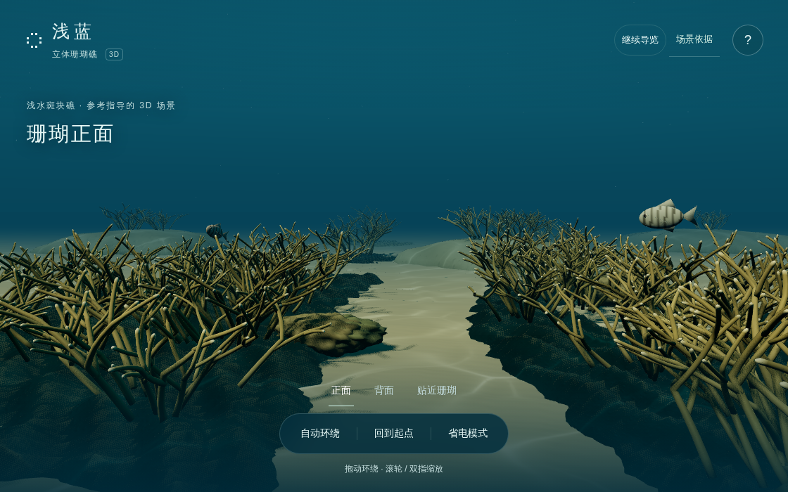
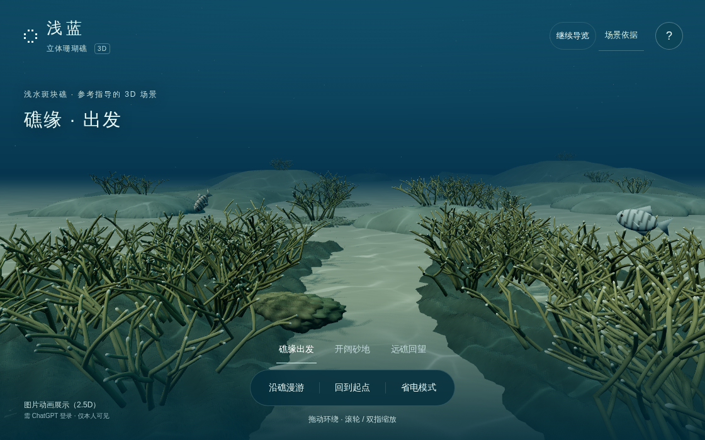
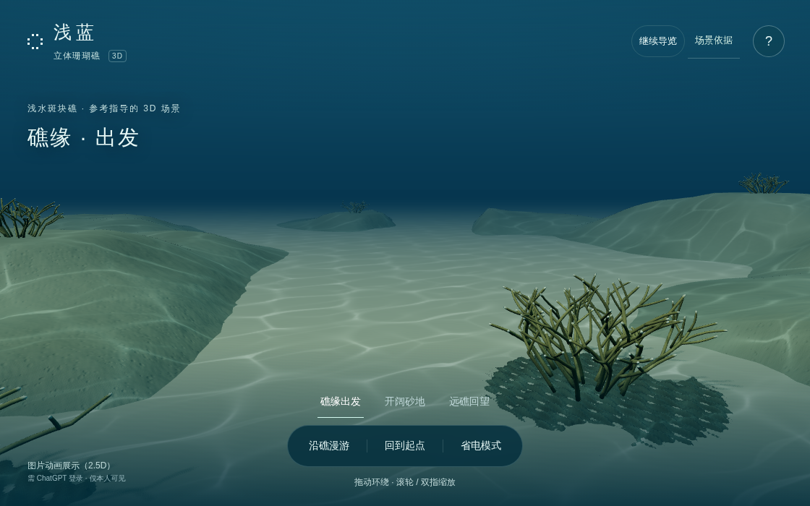
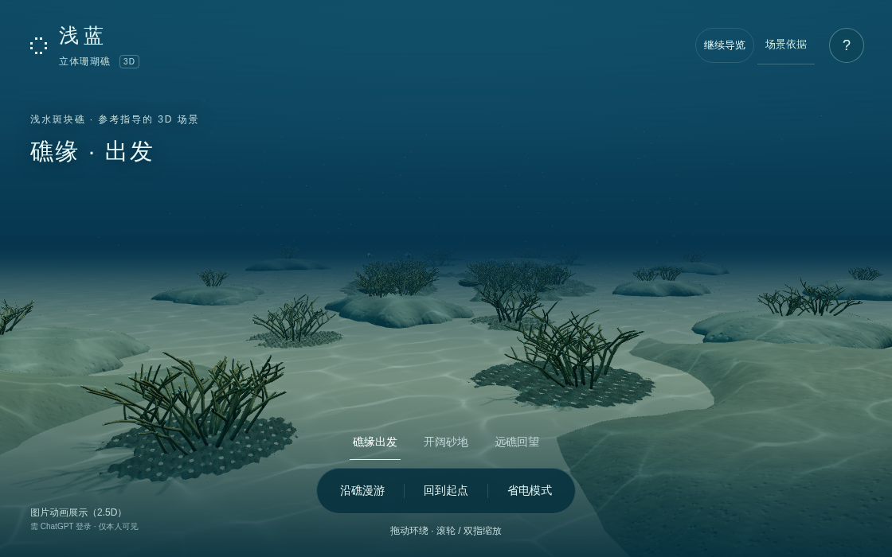
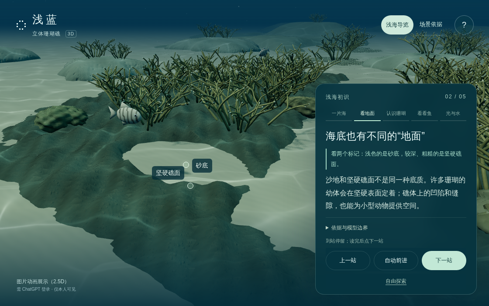

# 2026-10-07 · 阶段性空间与真实网页验收记录

## 目标与范围

目标是连续、可向中远景移动的幽蓝海底，呈现静谧、空间纵深和生命层次，而非仅能绕看的小型盆景。当前阶段是有限增量，整体自然感和用户设备表现尚未达标。

这是独立 QA 分支记录；当时的公开 Pages 保持原有模型，仅新增用户要求的独立 2.5D 展示入口。此记录不表示候选已部署。

## 来源链与独立提交

- 原公开场景：`7d7ee8f4445f4c1fe9051637685ba322c1aaa57b`
- 源码阶段 `f4f910d`：砂地外缘修复与材料试验的接受/拒绝记录；未单独上线
- 空间源码阶段 `000ea527eaeb03e1e6990cf88745b07b2a096335`，对应 QA 提交 `f4b602bdd913514d3e18036c1432705cbc884fdf`
- 控制修复源码阶段 `a19d100e94d13a0823cd9512254af42e50413406`，对应 QA 提交 `2b1d5581fc509195084308d3d003092daa8b9eba`

空间候选加入连续中远景地形、可达路径及出发/中途/回望视角；不是把旧相机强行拉远。旧模型/构图的保留及路径净空由源项目的几何证据单独检查，不能把这些静态检查当成浏览器验收。

## 真实渲染证据

使用 GitHub 普通 Ubuntu runner、Chromium 153、ANGLE/Vulkan SwiftShader 软件 WebGL2。Chromium 与 GPU 沙箱保持开启，没有忽略 GPU 黑名单或打开 unsafe SwiftShader。上下文像素读回正确，GL error=0。

- [基线运行37561682524](https://github.com/yydshly/azure-reef-3d/actions/runs/37561682524)：实际公开 Pages 加载模型，入口截图有效、4条鱼在8秒采样中位置变化。0控制台/页面/资源错误；背面相机过渡等待超时，整套未通过
- [候选运行37563565356](https://github.com/yydshly/azure-reef-3d/actions/runs/37563565356)：runner 本地 HTTP 服务加载冻结候选，真实模型及三张核心 WebGL 截图取得，坐标逐项核验。0控制台/页面/资源错误，鱼位置有变化。最后的海床导览相机约束检查失败，整套未通过

截图是实际浏览器输出，不是离线 Blender 渲染。候选使用已有公开应用 API 固定镜头，不代表原生点击、自然过渡或硬件帧率通过。截图中的路线进度文字仍保留出发状态，不能据它推断镜头未移动；实际相机坐标见 JSON 报告。

| 取景 | 位置 | 目标 |
| --- | --- | --- |
| 出发 | 1.5, 2.1, 4.8 | -0.5, 0.8, -6 |
| 中途 | 0, 2.7, -18 | -1.5, 1, -31 |
| 回望 | -3.8, 3.6, -36 | 0, 0.9, -8 |

### 原始截图

## 失败与修复

实际浏览器取证揭示海床导览目标 y=0.02 被 controls change handler 夹到0.3。此前未执行该真实 handler 的静态投影检查不能覆盖这个缺陷。`a19d100` 放低该限制并新增正常/减弱运动回归，同时修正回程暂停恢复方向。几何、材质和上述三核心视图不变。

[定向复验37564502286](https://github.com/yydshly/azure-reef-3d/actions/runs/37564502286) 单独检验修复后的开场与海床导览；结论在终态后补记，不把它冒充全部交互通过。

## 人工画面判断与下一步

空间跨度和移动方向比基线明确，但大面积空砂、重复枝丛、稀疏生命层次及偏硬阴影仍明显。用户提出的整体真实感/辽阔幽蓝效果仍未达成，不以构建或渲染成功代替设计验收。

下一步围绕真实参照下的连续硬底和斑块分布改善整体空间结构，再用同配置的真实 WebGL 图复审；不用新增孤立物种或堆砌小特效来掩盖结构问题。用户设备帧率、iPad表现和完整原生交互仍需单独验证。

## 定向复验终态

运行37564502286于2026-10-07 03:00:45 UTC成功完成。报告明确scope仅为开场与海床导览回归；目标高度实际为0.02，两个底质标记可见，控制台/页面/请求/HTTP错误均为0。此次不重复声称运动验收，运动样本仍以先前独立运行记录为准。

整体空间版可作为有限的阶段增量继续发布；这不是最终自然度、用户GPU帧率或全部原生交互的验收结论。
